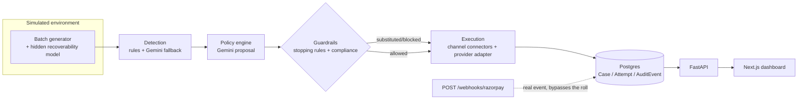

# Janus

**AI Revenue Recovery Agent — Razorpay Buildathon, Track 03**

Named for the Roman god of doorways and transitions, who looks both ways at
once and decides what passes through. Revenue leaks out of a business
through disconnected failure points: failed card/UPI debits, failed
subscription mandates, and overdue B2B invoices. Each is usually handled
reactively, generically, and without a record of what was tried or why.
Janus is a single agent that **detects** revenue at
risk across all three leak types, **diagnoses** the root cause per case,
**chooses** a bounded recovery action across an escalating channel ladder
(nudge → SMS/email → voice → human), **executes** it, and **reports**
measured recovery (₹ at risk vs ₹ recovered) with a full audit trail and
hard-coded compliance/stopping rules the LLM can't override.

This is not a real Razorpay integration — the batch runner works against a
synthetic environment with a hidden recoverability model, so the demo proves
the reasoning + guardrail + measurement loop rather than real payment
processing. `POST /webhooks/razorpay` (below) is the one place a real
Razorpay event *would* land.

**[Watch the demo video](https://youtu.be/TJOCuPYJ0XM)** (1:29)

## Architecture



Guardrails are plain deterministic Python with their own unit tests, not
prompt-only logic — they run *after* the LLM proposes an action and can
override or substitute it outright. See `CLAUDE.md` for the full phase-by-
phase build log, every route, and every design decision's rationale.

## One-command run

```bash
cp backend/.env.example backend/.env   # then fill in GEMINI_API_KEY
GEMINI_API_KEY=your_key_here docker compose up --build
```

- API: http://localhost:8000 (`/health`, `/docs`)
- Dashboard: http://localhost:3000

That boots Postgres, applies migrations, and serves both the API and the
Next.js dashboard — no local Python/Node install required. See `CLAUDE.md`
for the non-Docker local dev workflow (hot reload, running the test suite,
individual CLI demo scripts).

## Demo script

1. Land on `/` → **Run demo batch** (`/run?demo=1`, prefilled n=10, seed=42).
2. Dashboard populates live (₹ at risk/recovered, recovery rate, guardrail
   feed, recovery curve) as the batch runs in the background.
3. Drill into a recovered `insufficient_funds` case, then a
   `card_expired`/`send_update_link` case.
4. Drill into the `max_total_contacts`-escalated case — a stopping rule
   firing, not an LLM decision.
5. Drill into the DND-substitution case — a compliance rule swapping
   `voice_call` back to `send_reminder`, with the swap visible in the audit
   trail.
6. Play a voice-call transcript as agent/customer chat bubbles (browser TTS
   for the agent's side).
7. Read one case's full audit trail end-to-end, including the "Why this
   action?" card surfacing the LLM's rationale.
8. `/history` for every past run, `/tickets` for the support tickets
   `escalate_human` opened automatically.

## What broke, and how we got out

- **Gemini burst rate limits** deflated recovery rates mid-batch (a fresh
  batch came back heavy on `escalated_human` — the fail-safe fallback for an
  exhausted-retry LLM call, not a policy bug). Fixed with a client-side
  token-bucket limiter + exponential backoff + classification caching
  (`app/llm_resilience.py`).
- **A sim-clock leak**: LLM-chosen retry offsets were silently discarded
  because retry dates were built from the wall clock while the runner
  advances a simulated clock days ahead. The runner's clock now threads all
  the way through to the proposal call.
- **`AuditEvent` timestamp collisions**: Python-side `datetime.utcnow()`
  produced identical timestamps for events written in the same flush,
  breaking chronological ordering in the case timeline. Switched to
  Postgres's `clock_timestamp()`, evaluated per row.
- **Years of test-run accumulation** in the dev Postgres DB, because tests
  wrote real rows with no isolation. Fixed with a transaction-per-test
  fixture (SAVEPOINT-based) that rolls back every test — caught a real
  cross-test dependency bug in the process (one test file was silently
  relying on rows another file committed first).

Full incident-level detail (plus every phase's design rationale) is in
`CLAUDE.md`.

## Repo layout

```
/backend      FastAPI + SQLAlchemy + Postgres; simulation, detection, policy,
              execution, audit layers; Alembic migrations; pytest suite
/frontend     Next.js (App Router, TypeScript, Tailwind) dashboard
/revenue-recovery-agent-prd.md   Full product spec
/CLAUDE.md    Build log: every phase, route, and design decision
```
