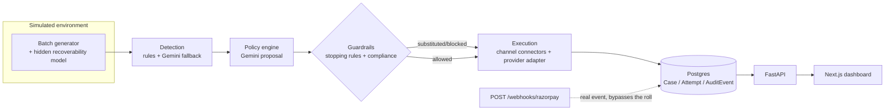

# Janus

**AI Revenue Recovery Agent** · Razorpay Buildathon, Track 03

[](https://youtu.be/TJOCuPYJ0XM)
[](#tech-stack)
[](#tech-stack)
[](#tech-stack)

Named for the Roman god of doorways and transitions, who looks both ways at
once and decides what passes through.

Revenue leaks out of a business through disconnected failure points —
failed card/UPI debits, failed subscription mandates, overdue B2B invoices —
each usually handled reactively, generically, and with no record of what
was tried or why. Janus is a single agent that **detects** revenue at risk
across all three leak types, **diagnoses** the root cause per case,
**chooses** a bounded recovery action across an escalating channel ladder
(nudge → SMS/email → voice → human), **executes** it, and **reports**
measured recovery (₹ at risk vs ₹ recovered) with a full audit trail and
compliance/stopping rules the LLM cannot override.

This is not a live Razorpay integration — the batch runner works against a
synthetic environment with a hidden recoverability model, so the demo
proves the reasoning + guardrail + measurement loop rather than real
payment processing. `POST /webhooks/razorpay` is the one place a real
Razorpay event *would* land.

**[Watch the demo video →](https://youtu.be/TJOCuPYJ0XM)** (1:29)

## Table of contents

- [Architecture](#architecture)
- [Quick start](#quick-start)
- [Tech stack](#tech-stack)
- [Engineering highlights](#engineering-highlights)
- [Repo layout](#repo-layout)

## Architecture



Guardrails are plain deterministic Python with their own unit tests, not
prompt-only logic — they run *after* the LLM proposes an action and can
override or substitute it outright. See [`CLAUDE.md`](./CLAUDE.md) for the
full phase-by-phase build log, every route, and every design decision's
rationale.

## Quick start

```bash
cp backend/.env.example backend/.env   # then fill in GEMINI_API_KEY
GEMINI_API_KEY=your_key_here docker compose up --build
```

| Service | URL |
|---|---|
| API | http://localhost:8000 (`/health`, `/docs`) |
| Dashboard | http://localhost:3000 |

One command boots Postgres, applies migrations, and serves both the API
and the Next.js dashboard — no local Python/Node install required. See
[`CLAUDE.md`](./CLAUDE.md) for the non-Docker local dev workflow (hot
reload, the pytest suite, individual CLI demo scripts).

## Tech stack

| Layer | Choice |
|---|---|
| LLM | Gemini API (`google-genai`) — cost-driven substitute for Claude/Anthropic |
| Backend | FastAPI, SQLAlchemy, Alembic |
| Database | Postgres (Docker Compose) |
| Frontend | Next.js (App Router), TypeScript, Tailwind |
| Tests | pytest, transaction-per-test isolation |

## Engineering highlights

- **Guardrails are code, not prompts.** Stopping rules (fraud/dispute →
  instant human escalation, no LLM call) and compliance substitutions
  (e.g. a DND-flagged customer's `voice_call` swapped for a compliant
  channel) are deterministic and unit-tested independently of the model.
- **Gemini's free-tier rate limits were the biggest reliability risk.** A
  client-side token-bucket limiter, exponential backoff honoring
  `Retry-After`, and a classification cache (`app/llm_resilience.py`) keep
  batches from collapsing mid-run; anything that still exhausts retries
  fails safe to `escalate_human` instead of crashing.
- **A sim-clock leak** silently discarded LLM-chosen retry offsets, because
  retry dates were built from the wall clock while the runner advances a
  simulated clock days ahead. Fixed by threading the simulated clock all
  the way through to the proposal call.
- **`AuditEvent` timestamp collisions** from Python-side `datetime.utcnow()`
  broke chronological ordering in the case timeline when multiple events
  landed in the same DB flush. Switched to Postgres's `clock_timestamp()`,
  evaluated per row.
- **Zero-isolation tests** were writing real rows into the dev Postgres
  instance, and one test file was silently relying on rows another file
  happened to commit first. Fixed with a transaction-per-test fixture
  (SAVEPOINT-based) that rolls back after every test.

Full incident-level detail — plus every phase's design rationale — is in
[`CLAUDE.md`](./CLAUDE.md).

## Repo layout

```
/backend      FastAPI + SQLAlchemy + Postgres; simulation, detection, policy,
              execution, audit layers; Alembic migrations; pytest suite
/frontend     Next.js (App Router, TypeScript, Tailwind) dashboard
/revenue-recovery-agent-prd.md   Full product spec
/CLAUDE.md    Build log: every phase, route, and design decision
```
