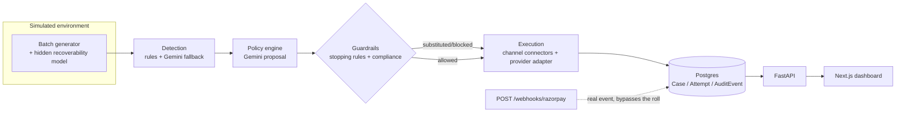

<p align="center">
  
</p>

<h1 align="center">Janus</h1>
<p align="center"><strong>AI Revenue Recovery Agent</strong> · Razorpay Buildathon, Track 03</p>

<p align="center">
  <a href="https://youtu.be/TJOCuPYJ0XM"></a>
  <a href="#tech-stack"></a>
  <a href="#tech-stack"></a>
  <a href="#tech-stack"></a>
</p>

Named for the Roman god of doorways and transitions, who looks both ways at
once and decides what passes through.

Revenue leaks out of a business through disconnected failure points —
failed card/UPI debits, failed subscription mandates, overdue B2B invoices —
each usually handled reactively, generically, and with no record of what
was tried or why. Janus is a single agent that **detects** revenue at risk
across all three leak types, **diagnoses** the root cause per case,
**chooses** a bounded recovery action across an escalating channel ladder
(nudge → SMS/email → voice → human), **executes** it, and **reports**
measured recovery (₹ at risk vs ₹ recovered) with a full audit trail and
compliance/stopping rules the LLM cannot override.

This is not a live Razorpay integration — the batch runner works against a
synthetic environment with a hidden recoverability model, so the demo
proves the reasoning + guardrail + measurement loop rather than real
payment processing. `POST /webhooks/razorpay` is the one place a real
Razorpay event *would* land.

<p align="center">
  <a href="https://youtu.be/TJOCuPYJ0XM">
    
  </a>
  <br />
  <sub>▶ 1:29 — click to watch on YouTube</sub>
</p>

## Table of contents

- [Features](#features)
- [Architecture](#architecture)
- [Quick start](#quick-start)
- [Tech stack](#tech-stack)
- [Integrating Janus into a real stack](#integrating-janus-into-a-real-stack)
- [Business value](#business-value)
- [Engineering highlights](#engineering-highlights)
- [Repo layout](#repo-layout)

## Features

- **Three leak types, one agent** — payment failures, mandate revocations,
  and overdue B2B receivables all flow through the same detect → diagnose →
  act → report loop instead of three disconnected tools.
- **Root-cause diagnosis** — deterministic rules classify unambiguous
  decline/failure codes; a Gemini fallback handles free-text or ambiguous
  cases only (kept to ~5% of volume by design, to control LLM cost).
- **Bounded action policy** — Gemini proposes the next recovery action per
  case (reminder tone, retry link, promise-to-pay ask, voice call, human
  escalation) from a fixed, allowed action set per case type.
- **Guardrails that are code, not prompts** — hard stopping rules (fraud/
  dispute → instant human escalation, no LLM call at all) and compliance
  substitution rules (e.g. a DND-flagged customer's `voice_call` swapped
  for a compliant channel) run *after* the LLM proposes, and can override
  or substitute it outright. Independently unit-tested.
- **Full audit trail** — every proposal, guardrail decision, execution
  attempt, and outcome is logged as a replayable event, not a summary
  number you have to trust.
- **Multi-tenant, no login wall** — every query is scoped by
  `merchant_id`, so a business (or a judge) can be onboarded without a
  signup flow, with an opt-in per-merchant API key for when auth is
  actually needed.
- **Live dashboard** — ₹ at risk/recovered, recovery rate by root cause, a
  guardrail-intervention feed, a recovery curve, and a scheduled-actions
  panel for cases mid-journey.
- **Auto-generated support tickets** — every human escalation opens a
  ticket, prioritized from the escalation reason (fraud/dispute → urgent,
  exhausted channels → high).

## Architecture



Guardrails are plain deterministic Python with their own unit tests, not
prompt-only logic — they run *after* the LLM proposes an action and can
override or substitute it outright. See [`CLAUDE.md`](./CLAUDE.md) for the
full phase-by-phase build log, every route, and every design decision's
rationale.

## Quick start

```bash
cp backend/.env.example backend/.env   # then fill in GEMINI_API_KEY
GEMINI_API_KEY=your_key_here docker compose up --build
```

| Service | URL |
|---|---|
| API | http://localhost:8000 (`/health`, `/docs`) |
| Dashboard | http://localhost:3000 |

One command boots Postgres, applies migrations, and serves both the API
and the Next.js dashboard — no local Python/Node install required. See
[`CLAUDE.md`](./CLAUDE.md) for the non-Docker local dev workflow (hot
reload, the pytest suite, individual CLI demo scripts).

## Tech stack

| Layer | Choice |
|---|---|
| LLM | Gemini API (`google-genai`) — cost-driven substitute for Claude/Anthropic |
| Backend | FastAPI, SQLAlchemy, Alembic |
| Database | Postgres (Docker Compose) |
| Frontend | Next.js (App Router), TypeScript, Tailwind |
| Tests | pytest, transaction-per-test isolation |

## Integrating Janus into a real stack

Every seam a real integration needs already exists in this codebase, not
just in the synthetic demo path:

1. **Ingest real failures via webhook.** `POST /webhooks/razorpay` mirrors
   Razorpay's actual scheme — `X-Razorpay-Signature` is an HMAC-SHA256 of
   the raw body, keyed by `RAZORPAY_WEBHOOK_SECRET`. `payment.captured`
   resolves the referenced case; `payment.failed` records an attempt. A
   different PSP just needs an equivalent adapter in front of the same
   case model.
2. **Swap the channel provider, not the pipeline.** `app/execution/
   providers.py`'s `ChannelProvider` interface is the seam where a real
   SMS/voice/email/WhatsApp API call happens. Implement it once against
   your real provider in place of the bundled `LoggingChannelProvider`,
   and detection, policy, guardrails, and audit logging are unchanged.
3. **Turn on per-merchant auth when you need it.** `REQUIRE_MERCHANT_API_KEY=true`
   requires `X-API-Key` on batch/job endpoints, checked against a key
   already generated per merchant — no separate auth system to build.
4. **Pull data into tooling you already have.** `GET /batches/{id}/summary`,
   `/guardrails`, `/curve`, and `/cases` are plain scoped JSON — wire them
   into an existing BI dashboard, a Slack alert, or a support tool instead
   of the bundled frontend.
5. **Pick your cadence.** Call the pipeline synchronously per failure event
   as it lands (`instant=True`), or run `POST /jobs/run-due` on a real cron
   for realistic multi-day recovery journeys (`instant=False`) — the same
   code path either way.

## Business value

Every case Janus works on is revenue that would otherwise sit as a
manual-collections queue item or get written off outright — both pure
cost centers today. The economics:

| | Manual collections | Janus |
|---|---|---|
| Marginal cost per case | Agent time (calls, follow-ups, CRM entry) | One bounded LLM call + channel cost (SMS/WhatsApp/voice), fractions of a cent to a few rupees |
| Coverage | Prioritized by case size, long tail often ignored | Every failure gets a decision, no case too small to work |
| Compliance risk | Depends on agent training/discipline | Enforced in code — calling-hours, DND, and contact-cap rules can't be skipped by a rushed agent or a misbehaving model |
| Auditability | Notes in a CRM, if any | Full event-level trail per case, reconstructible after the fact |

Because the alternative to recovery is usually ₹0, recovered revenue here
is close to pure margin, net only of the (small) automation cost — and the
guardrail layer converts compliance risk (an off-hours call, a contact
attempt on a fraud case) from a training problem into a solved one.

**Honest caveat:** the recovery-rate numbers this repo's demo batches
produce come from a synthetic recoverability model built to exercise the
reasoning + guardrail loop for the buildathon, not a live guarantee — a
real deployment's recovery rate depends on the merchant's actual customer
base and would need to be measured against it directly.

## Engineering highlights

- **Gemini's free-tier rate limits were the biggest reliability risk.** A
  client-side token-bucket limiter, exponential backoff honoring
  `Retry-After`, and a classification cache (`app/llm_resilience.py`) keep
  batches from collapsing mid-run; anything that still exhausts retries
  fails safe to `escalate_human` instead of crashing.
- **A sim-clock leak** silently discarded LLM-chosen retry offsets, because
  retry dates were built from the wall clock while the runner advances a
  simulated clock days ahead. Fixed by threading the simulated clock all
  the way through to the proposal call.
- **`AuditEvent` timestamp collisions** from Python-side `datetime.utcnow()`
  broke chronological ordering in the case timeline when multiple events
  landed in the same DB flush. Switched to Postgres's `clock_timestamp()`,
  evaluated per row.
- **Zero-isolation tests** were writing real rows into the dev Postgres
  instance, and one test file was silently relying on rows another file
  happened to commit first. Fixed with a transaction-per-test fixture
  (SAVEPOINT-based) that rolls back after every test.

Full incident-level detail — plus every phase's design rationale — is in
[`CLAUDE.md`](./CLAUDE.md).

## Repo layout

```
/backend      FastAPI + SQLAlchemy + Postgres; simulation, detection, policy,
              execution, audit layers; Alembic migrations; pytest suite
/frontend     Next.js (App Router, TypeScript, Tailwind) dashboard
/revenue-recovery-agent-prd.md   Full product spec
/CLAUDE.md    Build log: every phase, route, and design decision
```

---

<p align="center">
  Built by <a href="https://github.com/DewashishCodes"><strong>Dewashish</strong></a> for the Razorpay Buildathon (Track 03)
</p>
